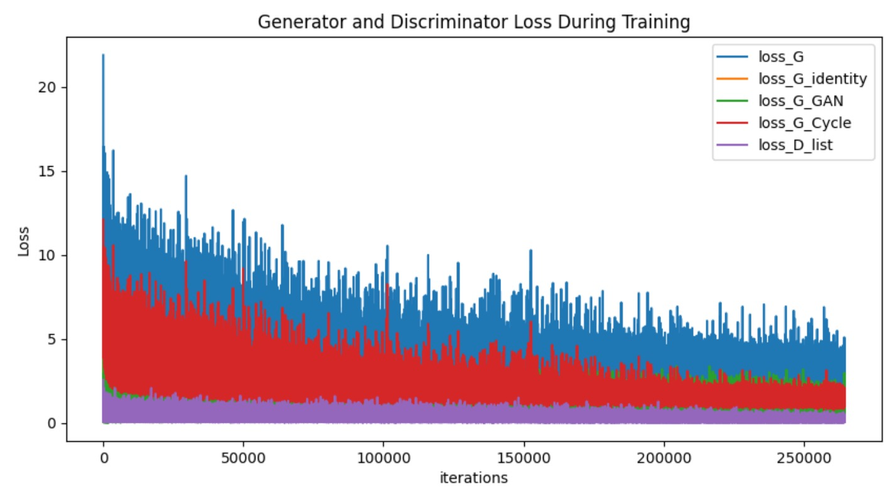
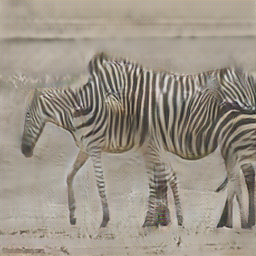
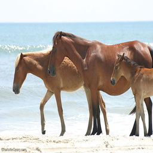

# CycleGAN(horse2zebra)
- 文件说明
  - ./ckpt: 存放中间训练权重
  - ./datasets: 存放数据(下载地址https://people.eecs.berkeley.edu/~taesung_park/CycleGAN/datasets/)
    - <dataset_name>
      - A(class A)
      - B(class B)
  - ./img_sys: 训练时生成的图片
  - ./output_img: 测试生成图片
  - args.py: 设置训练/测试参数
  - datasets.py: 构造数据集
  - utils.py: 额外函数
  - model.py: 模型
  - train.py: 训练模型
  - test.py: 测试模型

- 结果(200个epoch 在单卡3090上训练约12h)

  

> - 部分训练生成图片
>
>   - zebra2horse
>
>   
>
>   - horse2zebra
>
>   

>- 部分测试图片
>
>  - zebra2horse(生成图片 & 真实图片)
>
>    
>
>  - horse2zebra(生成图片 & 真实图片)
>
>    

> 参考资料
>
> [1] https://people.eecs.berkeley.edu/~taesung_park/CycleGAN/datasets/
>
> [2] https://github.com/junyanz/pytorch-CycleGAN-and-pix2pix
>
> [3] https://github.com/aitorzip/PyTorch-CycleGAN
>
> [4] [Zhu J Y, Park T, Isola P, et al. Unpaired image-to-image translation using cycle-consistent adversarial networks[C]//Proceedings of the IEEE international conference on computer vision. 2017: 2223-2232.](https://arxiv.org/abs/1703.10593)
